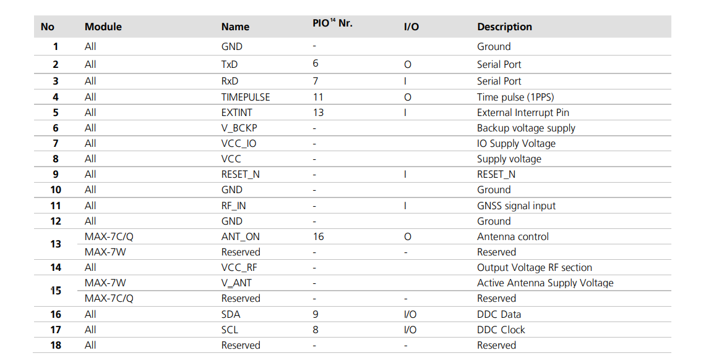

# u-blox GPS module

    u-blox芯片是瑞士优北罗股份有限公司（u-blox AG） (SIX:UBXN)所研发的芯片，
    主要面向定位与授时、蜂窝通信和短程通信三大核心市场。
    凭借其广泛及多样化的芯片、模块和日益扩大的产品支持数据服务生态系统，
    u-blox公司在帮助其客户针对物联网快速而成本高效地开发创新解决方案方面具有一定的行业优势。

    u‑blox的定位模块、SiP、芯片和天线引领了业内的性能基准，并可快速提供准确的位置数据。
    丰富的产品组合包括标准精度、高精度、精确定时和惯性导航解决方案等。

    u‑blox是全球导航卫星系统(GNSS)解决方案的领先供应商，可根据每位客户的需求量身定制。
    我们拥有自主的硅知识产权，可以提供可控的质量、高性能、快速支持和稳定的产品生命周期。
    u‑blox为车载导航系统、蜂窝基站时间同步、无人驾驶飞行器（UAV）
    以及人员和资产跟踪提供定位和时间产品。我们的产品在性能和成本效益方面树立了基准，
    在精确度、反欺骗、功率效率、尺寸和成本方面取得了创新性进展。
    有关产品概述，请参阅GNSS模块和系统级封装（SiP）线路卡，
    GNSS芯片线路卡以及GNSS模块概述和SiP概述。

[u-blox官方网站](https://www.u-blox.com/zh/positioning-chips-and-modules)

## MAX-7Q

    这里以MAX-7Q为例来说明GPS模块。
    我们使用NMEA协议模式进行通信, NMEA协议是GPS导航设备统一的RTCM标准协议。

    MAX-7Q包括UART接口和DDC/I2C接口，实际操作中使用UART接口进行通信。
    RF_IN引脚用于连接外部GPS天线。

## GSP

    GPS就是通过接受卫星信号，进行定位或者导航的终端。而接收信号就必须用到天线。
    GPS卫星信号分为L1和L2，频率分别为1575.42MHZ和1228MHZ，
    其中L1为开放的民用信号，信号为圆形极化。
    信号强度为-166dBW左右，属于比较弱的信号。 这些特点决定了要为GPS信号的接收准备专门的天线。

## NMEA协议

    NMEA是（National Marine Electronics Association ）为海用电子设备制定的标准格式。

    NMEA缩写，同时也是数据传输标准工业协会，在这里，实际上应为NMEA 0183。
    它是一套定义接收机输出的标准信息，有几种不同的格式，每种都是独立相关的ASCII格式，
    逗点隔开数据流，数据流长度从30-100字符不等，
    通常以每秒间隔选择输出，最常用的格式为"GGA"，
    它包含了定位时间，纬度，经度，高度，定位所用的卫星数，DOP值, 差分状态和校正时段等，
    其他的有速度，跟踪，日期等。NMEA实际上已成为所有的GPS接收机和最通用的数据输出格式，
    同时它也被用于与GPS接收机接口的大多数的软件包里。

    NMEA-0183协议定义的语句非常多，
    但是常用的或者说兼容性最广的语句只有$GPGGA、$GPGSA、$GPGSV、$GPRMC、$GPVTG、$GPGLL等。
    下面给出这些常用NMEA-0183语句的字段定义解释:

    例：$GPGSA,A,3,01,20,19,13,,,,,,,,,40.4,24.4,32.2*0A
    字段0：$GPGSA，语句ID，表明该语句为GPS DOP and Active Satellites（GSA）当前卫星信息
    字段1：定位模式(选择2D/3D)，A=自动选择，M=手动选择
    字段2：定位类型，1=未定位，2=2D定位，3=3D定位
    字段3：PRN码（伪随机噪声码），第1信道正在使用的卫星PRN码编号（00）（前导位数不足则补0）
    字段4：PRN码（伪随机噪声码），第2信道正在使用的卫星PRN码编号（00）（前导位数不足则补0）
    字段5：PRN码（伪随机噪声码），第3信道正在使用的卫星PRN码编号（00）（前导位数不足则补0）
    字段6：PRN码（伪随机噪声码），第4信道正在使用的卫星PRN码编号（00）（前导位数不足则补0）
    字段7：PRN码（伪随机噪声码），第5信道正在使用的卫星PRN码编号（00）（前导位数不足则补0）
    字段8：PRN码（伪随机噪声码），第6信道正在使用的卫星PRN码编号（00）（前导位数不足则补0）
    字段9：PRN码（伪随机噪声码），第7信道正在使用的卫星PRN码编号（00）（前导位数不足则补0）
    字段10：PRN码（伪随机噪声码），第8信道正在使用的卫星PRN码编号（00）（前导位数不足则补0）
    字段11：PRN码（伪随机噪声码），第9信道正在使用的卫星PRN码编号（00）（前导位数不足则补0）
    字段12：PRN码（伪随机噪声码），第10信道正在使用的卫星PRN码编号（00）（前导位数不足则补0）
    字段13：PRN码（伪随机噪声码），第11信道正在使用的卫星PRN码编号（00）（前导位数不足则补0）
    字段14：PRN码（伪随机噪声码），第12信道正在使用的卫星PRN码编号（00）（前导位数不足则补0）
    字段15：PDOP综合位置精度因子（0.5 - 99.9）
    字段16：HDOP水平精度因子（0.5 - 99.9）
    字段17：VDOP垂直精度因子（0.5 - 99.9）
    字段18：校验值（$与*之间的数异或后的值）
